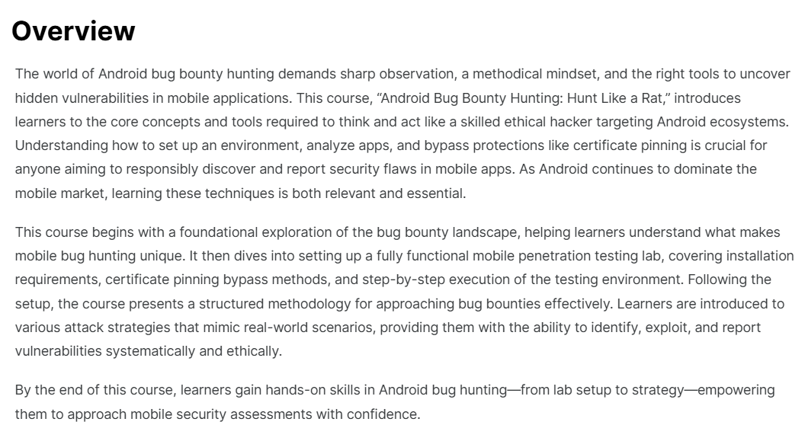
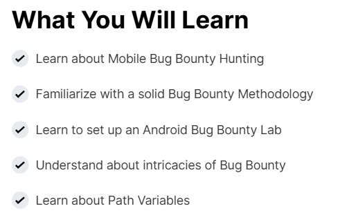
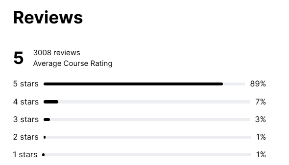

# 🐀 Android Bug Bounty Hunting – Hunt Like a Rat

This repository contains **notes, labs, demo scenarios, case studies, and certificate of completion** for the *Android Bug Bounty Hunting – Hunt Like a Rat (EC-Council Continue Learning)* program.  
It provides insights into **Android application security, vulnerability exploitation, and bug bounty hunting techniques**.

---

## 📚 Notes
- 📄 [01-introduction.md](./notes/01-introduction.md) – Course introduction  
- 📄 [02-android-security-basics.md](./notes/02-android-security-basics.md) – Basics of Android security  
- 📄 [03-recon-methods.md](./notes/03-recon-methods.md) – Reconnaissance methods for Android apps  
- 📄 [04-static-analysis.md](./notes/04-static-analysis.md) – Static APK analysis  
- 📄 [05-dynamic-analysis.md](./notes/05-dynamic-analysis.md) – Dynamic analysis techniques  
- 📄 [06-common-vulnerabilities.md](./notes/06-common-vulnerabilities.md) – Common Android vulnerabilities  
- 📄 [07-exploit-development.md](./notes/07-exploit-development.md) – Exploit development & PoC creation  
- 📄 [08-reporting-and-mitigation.md](./notes/08-reporting-and-mitigation.md) – Writing reports & mitigation strategies  

---

## 🧪 Labs
- ⚔️ [red-team-labs.md](./labs/red-team-labs.md) – Red Team exploitation labs  
- 🛡️ [blue-team-defense.md](./labs/blue-team-defense.md) – Blue Team defensive techniques  

---

## 🎬 Demo Scenarios
- 📑 [demo-examples01.md](./demo/demo-examples01.md) – APK analysis demo  
- 📑 [demo-examples02.md](./demo/demo-examples02.md) – SQL injection in mobile apps  
- 📑 [demo-examples03.md](./demo/demo-examples03.md) – MITM traffic capture demo  

---

## 🔬 Research & Extras
- 📑 [case-studies.md](./extras/case-studies.md) – Real-world case studies  
- 📆 [timeline.md](./extras/timeline.md) – Evolution of Android vulnerabilities & fixes  
- 📘 [resources.md](./extras/resources.md) – Extra resources for learning  

---

## 📖 Docs
- 📘 [glossary.md](./docs/glossary.md) – Glossary of Android security terms  
- 📘 [index.md](./docs/index.md) – Program overview  
- 📘 [references.md](./docs/references.md) – References & external sources  
- 📘 [roadmap.md](./docs/roadmap.md) – Learning roadmap  
- 📘 [syllabus.md](./docs/syllabus.md) – Detailed syllabus  

---

## 📸 Screenshots

| Step | Screenshot |
|-------------------------|------------|
| 🏫 Course Overview |  |
| ⭐ Key Lessons |  |
| 📝 Personal Review |  |

---

## 📜 Certificate
🎓 [Android Bug Bounty Hunting – Hunt Like a Rat](./cert/Android%20Bug%20Bounty%20Hunting%20Hunt%20Like%20a%20Rat.png)  

---

## 📝 Personal Review
This course provided me with **hands-on experience in Android application penetration testing**.  
I learned practical skills in:
- **Reconnaissance, static & dynamic analysis** of APKs  
- Identifying **SQL injection, insecure storage, and traffic interception vulnerabilities**  
- **Developing exploits & reporting findings responsibly**  

It is an excellent resource for anyone preparing to **enter mobile bug bounty hunting or Android app security research**.  

---

## ✍️ Author
**Thành Danh** – Red Team Learner & Security Researcher  

- GitHub: [@ngvuthdanhh](https://github.com/ngvuthdanhh)  
- Email: ngvu.thdanh@gmail.com  

---

## 📄 License
This project is licensed under the terms of the **MIT License**.  
See [LICENSE](./LICENSE) for full details.  
© 2025 ngvuthdanhh. All rights reserved.  
